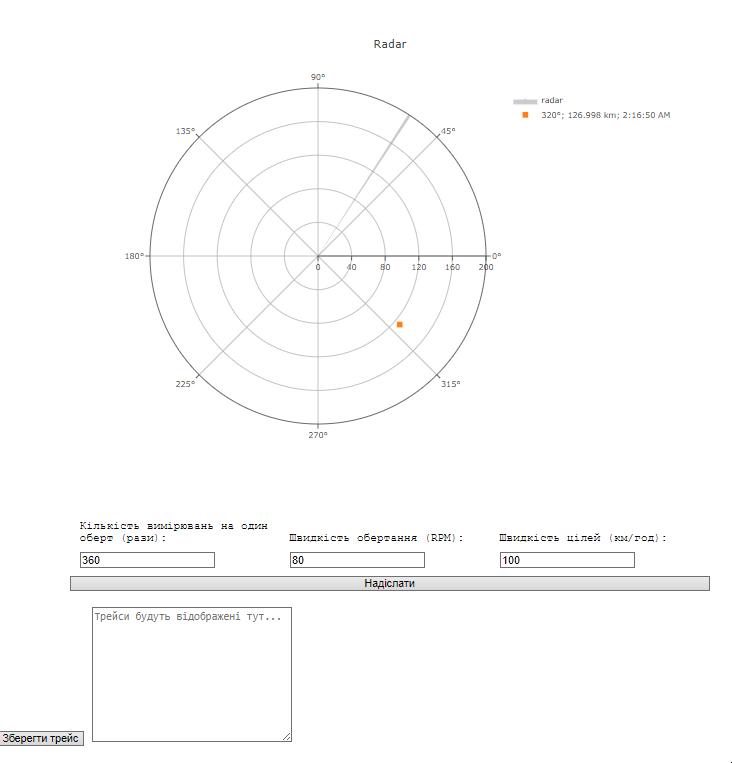

## Розробка додатку для візуалізації вимірювань радару. Колєснік Євгеній ІПЗ-4.01

## Завдання

Згідно до поставленого завдання необхідно було створити веб-додаток, що в реальному часі відображає дані про задетектовані цілі на графіку та дозволяє змінювати параметри радару.

1. Розробити додаток для відображення цілей:
    - Розробити веб-додаток, який підключається до WebSocket сервера та зчитує дані про задетектовані цілі;
    - Відобразити отримані дані на графіку в полярних координатах. Як варіант, можна використати бібліотеку Plotly або іншу бібліотеку для роботи з графіками.
2. Обробка та візуалізація даних:
    - Обробити дані, отримані через WebSocket, і відобразити цілі на графіку;
    - Кожна ціль повинна бути представлена як точка на графіку з координатами (кут, відстань);
    - Додати можливість зміни параметрів вимірювальної частини радару за допомогою API запитів.
3. Налаштування графіка:
    - Відобразити відстань у кілометрах на радіальній осі;
    - Використати різні кольори або стилі точок для відображення різних рівнів потужності сигналів, що повертаються від цілей.

## Конфігурація

Емулятор вимірювальної частини радару надається у вигляді Docker зображення під назвою radar-emulation-service.

Завантажимо зображення з Docker Hub:

> docker pull iperekrestov/university:radar-emulation-service

Запустимо контейнер з ім'ям `radar-emulator` на порту `4000` для з'єднання з емульованою вимірювальною частиною радару:

```bash
 docker run --name radar-e -p 4000:4000 iperekrestov/university:radar-emulation-service
```

## API

Сервіс підтримує API для зміни наступних параметрів радару:

**measurementsPerRotation** - кількість вимірювань на один оберт (одиниці: рази); 

**rotationSpeed** - швидкість обертання (одиниці: обертів за хвилину, RPM); 

**targetSpeed** - швидкість цілей (одиниці: км/год).

За замовчуванням застосовані наступні параметри:

**measurementsPerRotation** - 360 (рази);

**rotationSpeed** -  60 (обертів за хвилину);

**beamWidth** -  1 (градус);

**numberOfTargets** - 1;

**targetSpeed** - 100 (км/год);

**emulationZoneSize** - 200 (км).

Дані надсилаються через WebSocket містять інформацію про задетектовані цілі та передаються у форматі JSON:

```bash
{
  "scanAngle": 90, // Кут зондування у градусах (від 0 до 360)
  "pulseDuration": 1, // Тривалість імпульсу в мікросекундах
  "echoResponses": [
    {
      "time": 0.000012, // Час поширення імпульсу в секундах (двосторонній шлях)
      "power": 0.05 // Потужність відбитого сигналу (значення від 0 до 1)
    },
    {
      "time": 0.000024, // Час поширення імпульсу іншої цілі в секундах
      "power": 0.02 // Потужність відбитого сигналу іншої цілі
    }
  ]
}
```

## Технології

Для створення додатку радара використано JavaScript, HTML і CSS для інтерактивного інтерфейсу. Графіки створено з Plotly для розширених візуалізацій. Сервер працює на Node.js з Express і middleware для проксі та маршрутизації. Залежності керуються через npm.

## CORS

Щоб браузер міг надсилати запити (наприклад, POST, PUT) до конфігураційного сервера Docker радара (http://localhost:4000/config), веб-сервер повинен дозволяти ці запити з інших доменів.

Виявлено, що сервер не відповідав на OPTIONS запити. Для вирішення цього налаштовано проксі-сервер на порту 3000, що перенаправляє запити на http://localhost:4000 з використанням express і http-proxy-middleware.

Конфігурація включає:

- Проксі для API з обробкою заголовків CORS;
- Обробку статичних файлів з директорії public;
- Відповідь на запити до кореневого маршруту, надаючи HTML-файл.
- Налаштування сервера виконано у файлі proxy.js

Запуск проєкта виконується так:

> node proxy.js

## Приймання повідомлень радару

Для приймання повідомлень від радару було створено клас `RadarService`, файл `public/src/RadarService.js`. Він відповідальний за отримання `fetchConfiguration` та оновлення конфігурації `updateConfiguration`, а також за підключення до веб-сокета емудятора радару `connectWebSocket`. Його конструктор приймає адресу для конфігурації, адресу сокета та назву події, яку генерує сервіс для кожного повідомлення сокета.

## Будування графіку
 
Для будування графіку радару був створений клас `RadarGraph`, файл `public/src/RadarGraph.js`. Він відповідає за обробку прийнятих даних з веб-сокету `handleData`, назва події яких передається через конструктор, збереження локованих цілей `addPoint` та малювання графіку.

В залежності від рівня потужності сигналу цілі, виконується її різне позначення на графіку:
- Від 0 до 0.3: квадрат;
- Від 0.3 до 0.5: діамант;
- Від 0.5 до 0.1: круг.

В легенді графіка позначається час отримання даних та координати кожної цілі, дані відображаються впродовж 1 секунди.

## Конфігурація

Для відображення та зміни значень конфігурації радара, було створено клас `RadarConfig`, файл `public/src/RadarConfig.js`. Він відповідає за оновлення конфігурації радару `handleSubmit` та встановлення конфігурації до форми `setConfig`. У конструкторі він приймає калбек, якому передається зчитана з форми конфігурація радара.

## Головний асинхроний скрипт

У головному асинхронному скрипті, представленому у вашому коді, спочатку імпортуються три класи: `RadarService`, `RadarGraph` і `RadarConfig`, які, ймовірно, відповідають за обробку даних радара, візуалізацію графіків та конфігурацію, відповідно. Далі, у змінній `radarServiceProps`, задаються параметри для сервісу радара, які включають URL для конфігурації API та URL для WebSocket з'єднання, а також ім'я події, яка сигналізує про отримання нових даних радара.

Потім створюється новий екземпляр класу `RadarService` з переданими параметрами. Аналогічно, у змінній `radarGraphProps` визначаються параметри для графіка радара, зокрема, ID контейнера для графіка та ім'я події для отримання даних. На основі цих параметрів ініціалізується новий екземпляр класу `RadarGraph`.

Далі відбувається отримання HTML-елемента форми через ID `radarConfigForm` та створення нового екземпляра класу `RadarConfig`, в якому вказується, що при надсиланні даних з форми слід оновити конфігурацію сервісу радара за допомогою методу updateConfiguration, а також оновити конфігурацію самого об'єкта `radarConfig`.

Основна асинхронна функція main виконує три основні дії: спочатку вона чекає завершення отримання конфігурації через метод `fetchConfiguration` у `radarService`, потім підключається до WebSocket через connectWebSocket, і нарешті ініціалізує графік радара, передаючи йому поточну конфігурацію. Після цього конфігурація також оновлюється у об'єкті `radarConfig`.

## Перевірка

Запустимо проєкт, перевіримо працю радара, оновлення конфігурації та збереження даних:

Результат:



Радар успішно в реальному часі відображає дані веб-сокету, дозволяє змінювати конфігурацію та зберігати дані цілей за потрібності.

## Висновок

Виконуючи цю роботу я підтвердив теоретичний матеріал по взаємодії з WebSocket для отримання даних у реальному часі та налаштуванні сервісів через API. Під час виконання роботи я ознайомився з будуванням графіків радару на основі даних реального часу за допомогою WebSocket та бібліотеки Plotly, принципами праці радару, налаштування конфігурації через API. Отриманні знання є основою при розробці  систем пов'язаних з роботою з координатами.